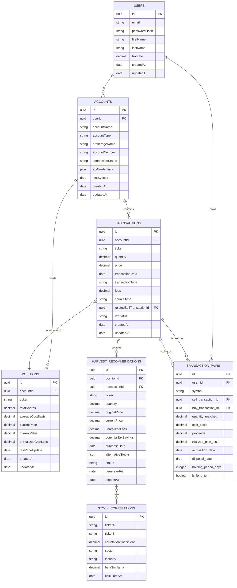

```mermaid
erDiagram 
    USERS {
        uuid id PK
        string email
        string passwordHash
        string firstName
        string lastName
        decimal taxRate
        date createdAt
        date updatedAt
    }
    
    ACCOUNTS {
        uuid id PK
        uuid userId FK
        string accountName
        string accountType
        string brokerageName
        string accountNumber
        string connectionStatus
        json apiCredentials
        date lastSynced
        date createdAt
        date updatedAt
    }

    TRANSACTIONS {
        uuid id PK
        uuid accountId FK
        string ticker
        decimal quantity
        decimal price
        date transactionDate
        string transactionType
        decimal fees
        string sourceType
        uuid relatedSellTransactionId FK
        string lotStatus
        date createdAt
        date updatedAt
    }

    POSITIONS {
        uuid id PK
        uuid accountId FK
        string ticker
        decimal totalShares
        decimal averageCostBasis
        decimal currentPrice
        decimal currentValue
        decimal unrealizedGainLoss
        date lastPriceUpdate
        date createdAt
        date updatedAt
    }

    STOCK_CORRELATIONS {
        uuid id PK
        string tickerA
        string tickerB
        decimal correlationCoefficient
        string sector
        string industry
        decimal betaSimilarity
        date calculatedAt
    }

    HARVEST_RECOMMENDATIONS {
        uuid id PK
        uuid positionId FK
        uuid transactionId FK
        string ticker
        decimal quantity
        decimal originalPrice
        decimal currentPrice
        decimal unrealizedLoss
        decimal potentialTaxSavings
        date purchaseDate
        json alternativeStocks
        string status
        date generatedAt
        date expiresAt
    }
    
    TRANSACTION_PAIRS {
        uuid id PK
        uuid user_id FK
        string symbol
        uuid sell_transaction_id FK
        uuid buy_transaction_id FK
        decimal quantity_matched
        decimal cost_basis
        decimal proceeds
        decimal realized_gain_loss
        date acquisition_date
        date disposal_date
        integer holding_period_days
        boolean is_long_term
    }

    USERS ||--o{ ACCOUNTS : has
    USERS ||--o{ TRANSACTION_PAIRS : owns
    ACCOUNTS ||--o{ TRANSACTIONS : contains
    ACCOUNTS ||--o{ POSITIONS : holds
    TRANSACTIONS }o--|| POSITIONS : contributes_to
    TRANSACTIONS ||--o{ HARVEST_RECOMMENDATIONS : sources
    TRANSACTIONS ||--o{ TRANSACTION_PAIRS : "is_sell_in"
    TRANSACTIONS ||--o{ TRANSACTION_PAIRS : "is_buy_in"
    HARVEST_RECOMMENDATIONS }o--o{ STOCK_CORRELATIONS : uses
```